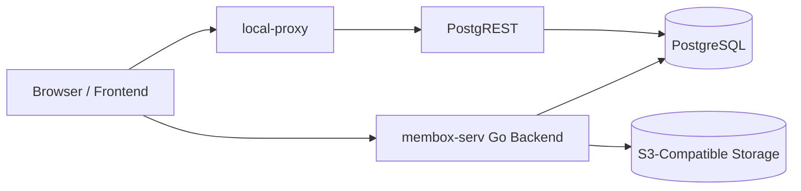

# Membox Service Project Documentation

This document describes the `membox-serv` backend in Turkish and English. It is written for developers who need to understand the project structure, runtime behavior, configuration model, and deployment flow without reverse-engineering the repository first.

Bu doküman `membox-serv` backend projesini Türkçe ve İngilizce olarak açıklar. Amaç, projeye yeni bakan bir yazılımcının klasör yapısını, çalışma mantığını, konfigürasyonu ve deploy akışını hızlıca anlayabilmesidir.

---

## Türkçe

### 1. Proje Özeti

`membox-serv`, AddMoments / Membox platformu için geliştirilmiş Go tabanlı bir backend servisidir. Uygulama; kullanıcı kimlik doğrulama, etkinlik yönetimi, misafir medya yüklemeleri, ürün ve ödeme akışları, promosyon yönetimi, admin paneli API'leri, Nova Poshta kargo entegrasyonu, S3 tabanlı dosya işlemleri ve bazı arka plan görevlerini tek servis içinde toplar.

Ana uygulama `main.go` dosyasından başlar. HTTP routing için Gorilla Mux kullanılır. Veri katmanı PostgreSQL üzerinde çalışır. Dosyalar S3 uyumlu object storage'a yazılır. Prod ortamında servis doğrudan HTTPS olarak `:443` portundan çalışır ve `:80` portundaki HTTP trafiğini HTTPS'e yönlendirir.

Projede ayrıca ayrı bir `db-shell/local-proxy` Go modülü vardır. Bu modül PostgREST önünde çalışan, JWT doğrulaması yapan bir reverse proxy'dir. Böylece bazı veri erişimleri PostgREST üzerinden, token doğrulaması local proxy tarafından yapılarak servis edilebilir.

### 2. Teknoloji Yığını

Backend:

- Go `1.24.2`
- Gorilla Mux
- PostgreSQL ve `lib/pq`
- `huandu/go-sqlbuilder`
- JWT (`golang-jwt/jwt/v5`)
- bcrypt (`golang.org/x/crypto`)
- AWS SDK for Go v1 ile S3 uyumlu storage
- LiqPay ve mock payment provider
- SMTP üzerinden e-posta gönderimi
- Nova Poshta API entegrasyonu
- QR üretimi için `yeqown/go-qrcode`
- Excel export için `xuri/excelize/v2`

Operasyon:

- systemd servisleri
- SSH/SCP tabanlı deploy scriptleri
- Let's Encrypt sertifika dosyalarıyla HTTPS
- PostgREST + ayrı local proxy deployment'ı

Bu repoda şu anda Dockerfile, docker-compose, CI workflow, Makefile, README veya Go test dosyası bulunmuyor.

### 3. Kök Proje Yapısı

```text
ukr-membox-serv-main/
├── main.go
├── go.mod
├── go.sum
├── src/
├── shell/
├── db-shell/
├── PROJECT_DOCUMENTATION.md
└── *.md
```

Kök seviyedeki önemli dosya ve klasörler:

- `main.go`: Ana uygulama giriş noktası. Router kurulumu, provider init, worker init, middleware ve HTTP/HTTPS server burada bağlanır.
- `go.mod` / `go.sum`: Ana Go servisinin dependency tanımları.
- `src/`: Uygulama kodlarının tamamı.
- `shell/`: Ana backend servisinin EC2'ye deploy edilmesi, systemd kurulumu ve restart işlemleri.
- `db-shell/`: PostgreSQL kurulum scriptleri, PostgREST konfigürasyonu ve PostgREST önündeki local proxy.
- `*.md`: Önceki analiz, recovery ve kapsam notları.

### 4. `src/` Klasörü

`src/` klasörü uygulamanın iş mantığını modüllere böler:

- `src/env/`: `.env` dosyasını okur. Dosya adı `.env` olsa da içerik JSON formatındadır.
- `src/auth/`: JWT üretimi/doğrulaması, auth middleware, super admin ve order panel middleware'leri.
- `src/db_layer/`: PostgreSQL bağlantısı, query helper'ları ve `LISTEN/NOTIFY` desteği.
- `src/db_scripts/`: Etkinlik tier bilgisi, feature kontrolleri, admin kontrolü, kullanıcı oluşturma/silme gibi domain sorguları.
- `src/routes/`: HTTP handler'lar. Auth, upload, product, order, promo, admin, QR, download, Nova Poshta proxy gibi route'lar burada bulunur.
- `src/payments/`: Payment provider soyutlaması ve ödeme callback akışı.
- `src/liqpay/`: LiqPay provider implementasyonu.
- `src/mock_paynet/`: Local/dev ödeme simülasyonu için mock provider.
- `src/s3-wrap/`: S3 upload/download, presigned URL, zip export ve storage boyutu hesaplama.
- `src/worker/`: PostgreSQL tabanlı job kuyruğu. Şu anda `s3_export` worker'ı için kullanılır.
- `src/storage_cron/`: Event storage süresiyle ilgili uyarı maili ve soft-delete görevleri.
- `src/promo_cron/`: Süresi dolan veya limitine ulaşan promo kodları pasifleştiren periyodik görev.
- `src/event_cleanup/`: Event medya temizliği ve snapshot işlemleri için yardımcı yapı.
- `src/send_email/`: SMTP bağlantısı ve HTML mail gönderimi.
- `src/novaposhta/`: Nova Poshta adres ve waybill API client'ı.
- `src/qr/`: QR kod üretimi.
- `src/mycrypto/`: Şifreleme, hash ve random helper'lar.
- `src/network_utils/`: JSON response ve error helper'ları.
- `src/types/`: Ortak kullanılan Go tipleri.
- `src/utils/`: UUID, hex ve hata yardımcıları.
- `src/serve-react/` ve `src/wp-proxy/`: Önceki/alternatif frontend proxy denemeleri. Ana akışta aktif kullanılmıyor; `main.go` fallback olarak redirect yapıyor.

### 5. Uygulama Başlangıç Akışı

Ana uygulama `main.go` içinde başlar.

Başlangıçta `init()` fonksiyonu çalışır:

1. `os.Args[1] == "true"` ise servis live modda kabul edilir.
2. Live modda PID dosyası yazılır.
3. `env.Env_init(is_live)` ile `.env` okunur.
4. S3 client init edilir.
5. PostgreSQL bağlantısı açılır ve basit ping sorgusuyla doğrulanır.
6. SMTP servisi init edilir.
7. Storage cron ve promo cron başlatılır.

`main()` içinde:

1. Gorilla Mux router oluşturulur.
2. Payment provider'lar (`mock_paynet`, `liqpay`) initialize edilir.
3. `s3_export` worker oluşturulur ve iki instance ile başlatılır.
4. PostgreSQL `job_insert` notification'ı dinlenir.
5. `/auth`, `/api`, `/l`, `/ui` route'ları kaydedilir.
6. CORS middleware uygulanır.
7. Live modda HTTPS server `:443`, HTTP redirect server `:80` üzerinde başlar.
8. Dev modda servis `.env.local_port` üzerinden HTTP çalışır.

Çalıştırma modları:

```bash
go run main.go
```

Dev mod. HTTP olarak lokal portta çalışır.

```bash
go run main.go true
```

Live mod. HTTPS `:443` ve HTTP to HTTPS redirect `:80` kullanır.

Prod binary çalıştırması systemd içinde şu şekildedir:

```bash
/home/ubuntu/membox-serv/main true
```

### 6. API Yapısı

Route'lar merkezi olarak `main.go` içinde tanımlanır.

Ana route grupları:

- `/auth`: E-posta/şifre giriş, whoami, hesap silme, signup email token akışı, şifre resetleme, collaborator işlemleri ve event silme.
- `/api/upload/{purpose}`: Authenticated dosya yükleme.
- `/api/guest/upload/{eventPackedUid}/{utype}`: Guest upload akışı. `webanon` rolüyle auth middleware kullanır.
- `/api/qr/{eventPackedUid}`: Etkinlik QR ayarları.
- `/api/calc-size/{eventPackedUid}`: Event storage boyutu hesaplama.
- `/api/products`: Ürün listesi.
- `/api/purchase`: Satın alma başlatma.
- `/api/purchase/{encPackedUID}/status`: Satın alma durumu.
- `/api/promo/validate`: Promo kod doğrulama.
- `/api/event/{eventPackedUid}/features`: Private feature bilgisi.
- `/api/event/{eventPackedUid}/public-features`: Public feature bilgisi.
- `/api/event/{eventPackedUid}/advertorial`: Advertorial alanı yönetimi.
- `/api/event/{eventPackedUid}/stats`: Event istatistikleri.
- `/api/event/{eventPackedUid}/extend-storage`: Storage uzatma hakkı.
- `/api/admin/*`: Super admin ve order panel admin işlemleri.
- `/api/np/settlements` ve `/api/np/warehouses`: Nova Poshta proxy endpoint'leri.
- `/api/download`: S3 download proxy.
- `/api/form/{formName}`: Form endpoint'i.
- `/api/payments/{tkn}`: Payment callback endpoint'i.
- `/l/{path}`: Kısa link yönlendirme.
- `/ui/{path}`: S3 üzerindeki static UI dosyalarına redirect.

Yetkilendirme katmanları:

- `AuthMiddleware(handler, "auth")`: Normal authenticated kullanıcı.
- `AuthMiddleware(handler, "webanon")`: Guest/web anonymous akışlar.
- `SuperAdminMiddleware`: `env.admin_emails` veya DB tarafındaki super admin rolü.
- `OrderPanelMiddleware`: Order admin veya super admin yetkisi.

### 7. Veri Katmanı

Ana backend doğrudan PostgreSQL'e bağlanır. Bağlantı ayarları `.env` içindeki `db` nesnesinden gelir.

`src/db_layer/core.go` şu sorumlulukları taşır:

- PostgreSQL connection string üretimi
- DB bağlantısını açma
- Basit bağlantı doğrulaması
- `Query_one`, `Query_all`, `Exec` helper'ları
- PostgreSQL `LISTEN/NOTIFY` desteği

SQL builder olarak `huandu/go-sqlbuilder` kullanılır. Kodun büyük kısmı SQL stringlerini elle birleştirmek yerine builder üzerinden üretir.

Ana DB objeleri `db-shell/misc/create-tables.sql` içinde tanımlanır:

- `users`
- `panel_admins`
- `credentials`
- `events`
- `events_public`
- `products`
- `carts`
- `cart_items`
- `promo_codes`
- `purchases`
- `participants`
- `uploads`
- `event_upload_snapshots`
- `global_attributes`
- `jobs`

PostgREST tarafı için roller ve izinler `db-shell/misc/setup.sql` içinde yönetilir:

- `webanon`: Anonymous rol.
- `auth`: JWT ile authenticated rol.
- `webanon` rolüne `auth` rolüne geçiş izni verilir.
- `events_public`, `products`, `uploads`, `participants` gibi objeler için gerekli izinler tanımlanır.
- RLS ve izin mantığı PostgREST erişimini sınırlandırmak için kullanılır.

### 8. Arka Plan Görevleri

Projede birkaç background görev vardır.

`storage_cron`:

- Event storage süresini takip eder.
- Süre dolmadan önce uyarı maili göndermek için kullanılır.
- Süresi dolan içerikler için soft-delete süreci çalıştırır.

`promo_cron`:

- Promo kodlarının `valid_until`, kullanım limiti ve aktiflik durumunu periyodik kontrol eder.
- Süresi dolmuş veya limitine ulaşmış kodları pasifleştirir.

`worker`:

- `jobs` tablosu üzerinden queue mantığı kurar.
- `FOR UPDATE SKIP LOCKED` ile aynı job'ın birden fazla worker tarafından alınmasını engeller.
- `job_insert` PostgreSQL notification'ını dinler.
- Şu anda `s3_export` job'ı için `routes.Export_s3` fonksiyonunu çalıştırır.

### 9. Konfigürasyon

Ana servis çalışma dizinindeki `.env` dosyasını okur. Dosya gitignore içindedir ve gerçek secret değerleri repoya konmamalıdır.

Önemli not: Bu projede `.env` dosyası klasik `KEY=value` formatında değil, JSON formatındadır.

Beklenen yapı:

```json
{
  "serv_root": "serv.addmoments.com.ua",
  "local_port": 8080,
  "db": {
    "host": "localhost",
    "port": 5432,
    "username": "user",
    "password": "password",
    "dbname": "membox_db"
  },
  "dev_key": "...",
  "jwt_secret": "...",
  "s3": {
    "key_id": "...",
    "key_secret": "...",
    "bucket": "...",
    "region": "...",
    "endpoint": "..."
  },
  "payment_secret": "...",
  "smtp": {
    "outgoing_server": "...",
    "smtp_port": 587,
    "username": "...",
    "password": "...",
    "display_name": "..."
  },
  "server_unique_name": "membox-prod-1",
  "admin_emails": ["admin@example.com"],
  "liqpay": {
    "public_key": "...",
    "private_key": "...",
    "sandbox": false
  },
  "nova_poshta": {
    "api_key": "...",
    "sender_ref": "...",
    "sender_contact_ref": "...",
    "sender_address_ref": "...",
    "sender_city_ref": "...",
    "sender_phone": "..."
  }
}
```

`db-shell/local-proxy` için ayrı config dosyası kullanılır:

```json
{
  "listenHttps": true,
  "listenHttp": false,
  "localPort": 3000,
  "certPath": "/path/to/fullchain.pem",
  "keyPath": "/path/to/privkey.pem",
  "jwtSecret": "..."
}
```

PostgREST örnek konfigürasyonu `db-shell/misc/-etc-postgrest.conf.example` içindedir.

Gitignore ile dışarıda tutulan hassas dosyalar:

- `.env`
- `*.pem`
- `local-proxy-config.json`
- `*postgrest.conf`
- `mockpnet/`

### 10. Deployment

#### 10.1 Ana Backend Servisi

Ana deploy script'i:

```bash
shell/deploy.sh
```

Script'in yaptığı işler:

1. `src/`, `shell/`, `main.go`, `go.mod`, `go.sum` ve `.env` dosyasını tar paketi haline getirir.
2. PEM dosyasını pakete dahil etmez.
3. Paketi `ubuntu@16.171.47.166:/home/ubuntu/membox-serv/` hedefine SCP ile kopyalar.
4. Uzak sunucuda paketi açar.
5. `go build main.go` çalıştırır.
6. Kaynak `src/` klasörünü uzak sunucuda siler.
7. `systemctl daemon-reload` çalıştırır.
8. `membox-serv` systemd servisini restart eder.
9. Servis durumunu gösterir.

Systemd unit:

```text
shell/servicefile.service
```

Servis bilgileri:

- Servis adı: `membox-serv`
- Working directory: `/home/ubuntu/membox-serv`
- ExecStart: `/home/ubuntu/membox-serv/main true`
- User/Group: `root`
- Restart policy: `always`

İlk kurulum için:

```bash
shell/setup.sh
```

Bu script manuel SSH bağlantısı içinde satır satır çalıştırılmak üzere yazılmıştır. Servis dosyasını `/etc/systemd/system/membox-serv.service` hedefine kopyalar, daemon reload yapar, servisi restart eder ve enable eder.

Servis restart/log izleme:

```bash
shell/restart_serv.sh
```

Bu script:

- `sudo systemctl restart membox-serv`
- `sudo systemctl status membox-serv`
- `journalctl -u membox-serv -n 100 -f`

komutlarını çalıştırır.

#### 10.2 DB Proxy / PostgREST Deployment

`db-shell/local-proxy` ayrı bir Go modülüdür. PostgREST'i doğrudan expose etmek yerine, önünde JWT doğrulayan bir reverse proxy olarak çalışır.

Deploy script'i:

```bash
db-shell/deploy-local-proxy.sh
```

Script'in yaptığı işler:

1. `db-shell/local-proxy/` klasörünü paketler.
2. Paketi `ubuntu@13.53.198.197:/home/ubuntu/db-proxy/` hedefine kopyalar.
3. Uzak sunucuda paketi açar.
4. `go build local-proxy.go` çalıştırır.
5. Kaynak dosyaları temizler.

Uzak restart script'i:

```bash
db-shell/deploy-remote.sh
```

PostgREST ve local proxy için systemd servis örnekleri:

- `db-shell/misc/-etc-systemd-system-localproxy.service`
- `db-shell/misc/-etc-systemd-system-postgrest.service`

PostgREST örnek config:

```text
db-shell/misc/-etc-postgrest.conf.example
```

Örnek mimari:



### 11. Lokal Geliştirme

Minimum lokal çalışma adımları:

1. Go `1.24.2` veya uyumlu bir Go sürümü kurulu olmalı.
2. PostgreSQL erişimi hazırlanmalı.
3. S3 uyumlu storage bilgileri hazırlanmalı.
4. SMTP, LiqPay ve Nova Poshta değerleri için dev/test credential'ları hazırlanmalı.
5. Kök dizine JSON formatında `.env` dosyası eklenmeli.
6. Dependency'ler indirilmelidir:

```bash
go mod download
```

7. Uygulama dev modda çalıştırılır:

```bash
go run main.go
```

Dev modda:

- HTTPS kullanılmaz.
- Port `.env.local_port` değerinden alınır.
- Tanımsız frontend route'ları `http://localhost:3000` adresine redirect edilir.
- `/api/purchase/{encPackedUID}/simulate-success` sadece dev modda açılır.

### 12. Build, Test ve Kontrol Komutları

Ana servis build:

```bash
go build main.go
```

Tüm Go paketlerini build ile doğrulama:

```bash
go build ./...
```

Ana servis local run:

```bash
go run main.go
```

Live mod simülasyonu:

```bash
go run main.go true
```

DB proxy build:

```bash
cd db-shell/local-proxy
go build local-proxy.go
```

Test:

```bash
go test ./...
```

Not: Repoda şu anda `*_test.go` dosyası bulunmadığı için test kapsamı tanımlı değildir.

Format:

```bash
go fmt ./...
```

Lint:

Projede şu anda resmi `golangci-lint` veya CI lint konfigürasyonu yoktur.

### 13. Güvenlik ve Operasyon Notları

- `.env`, PEM dosyaları ve proxy config dosyaları repoya commit edilmemelidir.
- `shell/deploy.sh` `.env` dosyasını prod sunucuya kopyalar; bu nedenle lokal `.env` içeriğinin hedef ortam için doğru olduğundan emin olunmalıdır.
- Ana servis prod modda Let's Encrypt sertifikalarını sabit path'lerden okur:
  - `/etc/letsencrypt/live/serv.addmoments.com.ua/fullchain.pem`
  - `/etc/letsencrypt/live/serv.addmoments.com.ua/privkey.pem`
- CORS şu anda wildcard yapıdadır. Public production servisinde origin allowlist'e geçiş değerlendirilmelidir.
- Super admin yetkisi hem `env.admin_emails` hem de DB tarafındaki `panel_admins` modeliyle ilişkilidir.
- DB bağlantısında `sslmode=disable` kullanılır. Network topolojisi ve DB lokasyonuna göre TLS ihtiyacı ayrıca değerlendirilmelidir.
- Deployment scriptleri doğrudan IP ve kullanıcı bilgisi içerir. Uzun vadede bunların ortam değişkeni veya CI secret olarak taşınması daha sağlıklı olur.

### 14. Geliştirici İçin Hızlı Harita

Yeni bir endpoint eklemek için genellikle:

1. Handler `src/routes/` altında oluşturulur veya mevcut route struct'ına eklenir.
2. Gerekli domain sorgusu `src/db_scripts/` veya ilgili route dosyasında yazılır.
3. Auth gereksinimine göre middleware seçilir.
4. Route `main.go` içinde doğru prefix altına kaydedilir.
5. Eğer DB şeması değişiyorsa `db-shell/misc/create-tables.sql` ve gerekiyorsa `setup.sql` güncellenir.
6. `go build ./...` ile build doğrulanır.

Yeni bir config alanı eklemek için:

1. `src/env/env-init.go` içindeki `env` struct'ına JSON tag ile alan eklenir.
2. Lokal ve prod `.env` dosyalarına karşılığı eklenir.
3. Secret ise repoda örnek değer dışında gerçek değer tutulmaz.

Yeni bir background job eklemek için:

1. `jobs` tablosundaki modelin mevcut davranışı incelenir.
2. `src/worker/` içindeki `Worker` yapısı kullanılır.
3. Job handler fonksiyonu `Worker_job_func` imzasına uygun yazılır.
4. `main.go` içinde worker init edilir ve gerekirse DB notification ile tetiklenir.

---

## English

### 1. Project Overview

`membox-serv` is a Go backend service built for the AddMoments / Membox platform. It handles authentication, event management, guest media uploads, product and payment flows, promo code management, admin APIs, Nova Poshta shipping integration, S3-based file operations, and several background jobs.

The main application starts from `main.go`. It uses Gorilla Mux for routing, PostgreSQL as the primary database, and S3-compatible object storage for media/files. In production mode, the service runs HTTPS directly on `:443` and redirects HTTP traffic from `:80` to HTTPS.

The repository also contains a separate Go module under `db-shell/local-proxy`. That service is a JWT-validating reverse proxy in front of PostgREST. It allows selected database access to be served through PostgREST while keeping token validation in the proxy layer.

### 2. Technology Stack

Backend:

- Go `1.24.2`
- Gorilla Mux
- PostgreSQL with `lib/pq`
- `huandu/go-sqlbuilder`
- JWT (`golang-jwt/jwt/v5`)
- bcrypt (`golang.org/x/crypto`)
- AWS SDK for Go v1 for S3-compatible storage
- LiqPay and mock payment provider
- SMTP email delivery
- Nova Poshta API integration
- QR generation with `yeqown/go-qrcode`
- Excel export with `xuri/excelize/v2`

Operations:

- systemd services
- SSH/SCP based deployment scripts
- HTTPS via Let's Encrypt certificate files
- PostgREST plus a separate local proxy deployment

The repository currently does not include Docker, docker-compose, CI workflow, Makefile, README, or Go test files.

### 3. Root Structure

```text
ukr-membox-serv-main/
├── main.go
├── go.mod
├── go.sum
├── src/
├── shell/
├── db-shell/
├── PROJECT_DOCUMENTATION.md
└── *.md
```

Important root-level paths:

- `main.go`: Main application entry point. It wires routing, providers, workers, middleware, and HTTP/HTTPS servers.
- `go.mod` / `go.sum`: Dependency definitions for the main Go service.
- `src/`: Application source code.
- `shell/`: Deployment, systemd setup, and restart scripts for the main backend service.
- `db-shell/`: PostgreSQL setup scripts, PostgREST configuration, and the local proxy that sits in front of PostgREST.
- `*.md`: Previous analysis, recovery, and implementation notes.

### 4. `src/` Directory

The `src/` directory splits the backend into focused modules:

- `src/env/`: Loads the `.env` file. Despite its name, the file content is JSON.
- `src/auth/`: JWT creation/validation, auth middleware, super admin middleware, and order panel middleware.
- `src/db_layer/`: PostgreSQL connection, query helpers, and `LISTEN/NOTIFY` support.
- `src/db_scripts/`: Domain-level queries such as event tier, features, admin checks, user creation, and user removal.
- `src/routes/`: HTTP handlers for auth, upload, product, order, promo, admin, QR, download, and Nova Poshta proxy flows.
- `src/payments/`: Payment provider abstraction and callback flow.
- `src/liqpay/`: LiqPay provider implementation.
- `src/mock_paynet/`: Mock payment provider for local/dev simulation.
- `src/s3-wrap/`: S3 upload/download, presigned URLs, zip export, and storage size calculation.
- `src/worker/`: PostgreSQL-backed job queue. Currently used for the `s3_export` worker.
- `src/storage_cron/`: Event storage lifecycle tasks, including warning email and soft-delete behavior.
- `src/promo_cron/`: Periodic promo code expiration and usage-limit checks.
- `src/event_cleanup/`: Helpers for event media cleanup and snapshots.
- `src/send_email/`: SMTP setup and HTML email delivery.
- `src/novaposhta/`: Nova Poshta address and waybill API client.
- `src/qr/`: QR code generation.
- `src/mycrypto/`: Encryption, hashing, and random helper utilities.
- `src/network_utils/`: JSON response and error helpers.
- `src/types/`: Shared Go types.
- `src/utils/`: UUID, hex, and error helpers.
- `src/serve-react/` and `src/wp-proxy/`: Older or alternative frontend proxy attempts. The active path in `main.go` uses redirects instead.

### 5. Application Startup Flow

The main service starts in `main.go`.

The `init()` function:

1. Treats the service as live when `os.Args[1] == "true"`.
2. Writes a PID file in live mode.
3. Loads `.env` through `env.Env_init(is_live)`.
4. Initializes the S3 client.
5. Opens and verifies the PostgreSQL connection.
6. Initializes SMTP email delivery.
7. Starts storage and promo cron tasks.

The `main()` function:

1. Creates the Gorilla Mux router.
2. Initializes payment providers (`mock_paynet`, `liqpay`).
3. Creates the `s3_export` worker with two instances.
4. Listens for PostgreSQL `job_insert` notifications.
5. Registers `/auth`, `/api`, `/l`, and `/ui` routes.
6. Applies CORS middleware.
7. In live mode, starts HTTPS on `:443` and HTTP-to-HTTPS redirect on `:80`.
8. In dev mode, starts HTTP on `.env.local_port`.

Run modes:

```bash
go run main.go
```

Development mode. Runs over HTTP on the configured local port.

```bash
go run main.go true
```

Live mode. Uses HTTPS on `:443` and HTTP-to-HTTPS redirect on `:80`.

The production systemd service runs:

```bash
/home/ubuntu/membox-serv/main true
```

### 6. API Structure

Routes are centrally registered in `main.go`.

Main route groups:

- `/auth`: Email/password sign-in, whoami, account deletion, signup email token flow, password reset, collaborator operations, and event deletion.
- `/api/upload/{purpose}`: Authenticated upload.
- `/api/guest/upload/{eventPackedUid}/{utype}`: Guest upload flow using the `webanon` role.
- `/api/qr/{eventPackedUid}`: Event QR settings.
- `/api/calc-size/{eventPackedUid}`: Event storage size calculation.
- `/api/products`: Product listing.
- `/api/purchase`: Purchase creation.
- `/api/purchase/{encPackedUID}/status`: Purchase status.
- `/api/promo/validate`: Promo code validation.
- `/api/event/{eventPackedUid}/features`: Private feature information.
- `/api/event/{eventPackedUid}/public-features`: Public feature information.
- `/api/event/{eventPackedUid}/advertorial`: Advertorial configuration.
- `/api/event/{eventPackedUid}/stats`: Event statistics.
- `/api/event/{eventPackedUid}/extend-storage`: Storage extension action.
- `/api/admin/*`: Super admin and order panel APIs.
- `/api/np/settlements` and `/api/np/warehouses`: Nova Poshta proxy endpoints.
- `/api/download`: S3 download proxy.
- `/api/form/{formName}`: Form endpoint.
- `/api/payments/{tkn}`: Payment callback endpoint.
- `/l/{path}`: Short link redirect.
- `/ui/{path}`: Redirects to static UI assets on S3.

Authorization layers:

- `AuthMiddleware(handler, "auth")`: Regular authenticated user.
- `AuthMiddleware(handler, "webanon")`: Guest/web anonymous flows.
- `SuperAdminMiddleware`: `env.admin_emails` or DB-backed super admin role.
- `OrderPanelMiddleware`: Order admin or super admin access.

### 7. Data Layer

The main backend connects directly to PostgreSQL. Database settings come from the `db` object in `.env`.

`src/db_layer/core.go` is responsible for:

- Building the PostgreSQL connection string
- Opening the DB connection
- Running a simple connection verification query
- Providing `Query_one`, `Query_all`, and `Exec` helpers
- Supporting PostgreSQL `LISTEN/NOTIFY`

SQL queries are commonly built through `huandu/go-sqlbuilder` instead of ad hoc string concatenation.

Primary DB objects are defined in `db-shell/misc/create-tables.sql`:

- `users`
- `panel_admins`
- `credentials`
- `events`
- `events_public`
- `products`
- `carts`
- `cart_items`
- `promo_codes`
- `purchases`
- `participants`
- `uploads`
- `event_upload_snapshots`
- `global_attributes`
- `jobs`

PostgREST roles and permissions are managed in `db-shell/misc/setup.sql`:

- `webanon`: Anonymous role.
- `auth`: Authenticated JWT role.
- `webanon` is allowed to switch to `auth`.
- Permissions are granted for selected objects such as `events_public`, `products`, `uploads`, and `participants`.
- RLS and permission rules are used to constrain PostgREST access.

### 8. Background Jobs

The project includes several background processes.

`storage_cron`:

- Tracks event storage lifecycle.
- Sends warning emails before expiration.
- Runs soft-delete behavior when storage expires.

`promo_cron`:

- Periodically checks promo code `valid_until`, usage limit, and active status.
- Deactivates expired or fully used codes.

`worker`:

- Implements a queue over the `jobs` table.
- Uses `FOR UPDATE SKIP LOCKED` to prevent duplicate job processing.
- Listens for the `job_insert` PostgreSQL notification.
- Currently runs `routes.Export_s3` for `s3_export` jobs.

### 9. Configuration

The main service reads a `.env` file from its working directory. The file is gitignored and must not contain committed secrets.

Important: In this project, `.env` is JSON, not classic `KEY=value` syntax.

Expected shape:

```json
{
  "serv_root": "serv.addmoments.com.ua",
  "local_port": 8080,
  "db": {
    "host": "localhost",
    "port": 5432,
    "username": "user",
    "password": "password",
    "dbname": "membox_db"
  },
  "dev_key": "...",
  "jwt_secret": "...",
  "s3": {
    "key_id": "...",
    "key_secret": "...",
    "bucket": "...",
    "region": "...",
    "endpoint": "..."
  },
  "payment_secret": "...",
  "smtp": {
    "outgoing_server": "...",
    "smtp_port": 587,
    "username": "...",
    "password": "...",
    "display_name": "..."
  },
  "server_unique_name": "membox-prod-1",
  "admin_emails": ["admin@example.com"],
  "liqpay": {
    "public_key": "...",
    "private_key": "...",
    "sandbox": false
  },
  "nova_poshta": {
    "api_key": "...",
    "sender_ref": "...",
    "sender_contact_ref": "...",
    "sender_address_ref": "...",
    "sender_city_ref": "...",
    "sender_phone": "..."
  }
}
```

`db-shell/local-proxy` uses a separate config file:

```json
{
  "listenHttps": true,
  "listenHttp": false,
  "localPort": 3000,
  "certPath": "/path/to/fullchain.pem",
  "keyPath": "/path/to/privkey.pem",
  "jwtSecret": "..."
}
```

PostgREST has an example configuration in `db-shell/misc/-etc-postgrest.conf.example`.

Sensitive files excluded by gitignore:

- `.env`
- `*.pem`
- `local-proxy-config.json`
- `*postgrest.conf`
- `mockpnet/`

### 10. Deployment

#### 10.1 Main Backend Service

Main deploy script:

```bash
shell/deploy.sh
```

What the script does:

1. Creates a tar package with `src/`, `shell/`, `main.go`, `go.mod`, `go.sum`, and `.env`.
2. Excludes the PEM file from the archive.
3. Copies the archive to `ubuntu@16.171.47.166:/home/ubuntu/membox-serv/` via SCP.
4. Extracts the archive on the remote server.
5. Runs `go build main.go`.
6. Removes the remote `src/` source directory after build.
7. Runs `systemctl daemon-reload`.
8. Restarts the `membox-serv` systemd service.
9. Prints the service status.

Systemd unit:

```text
shell/servicefile.service
```

Service details:

- Service name: `membox-serv`
- Working directory: `/home/ubuntu/membox-serv`
- ExecStart: `/home/ubuntu/membox-serv/main true`
- User/Group: `root`
- Restart policy: `always`

Initial setup:

```bash
shell/setup.sh
```

This script is intended to be pasted line by line into an SSH session. It copies the service file to `/etc/systemd/system/membox-serv.service`, reloads systemd, restarts the service, and enables it.

Restart and logs:

```bash
shell/restart_serv.sh
```

It runs:

- `sudo systemctl restart membox-serv`
- `sudo systemctl status membox-serv`
- `journalctl -u membox-serv -n 100 -f`

#### 10.2 DB Proxy / PostgREST Deployment

`db-shell/local-proxy` is a separate Go module. It works as a JWT-validating reverse proxy in front of PostgREST instead of exposing PostgREST directly.

Deploy script:

```bash
db-shell/deploy-local-proxy.sh
```

What the script does:

1. Packages `db-shell/local-proxy/`.
2. Copies it to `ubuntu@13.53.198.197:/home/ubuntu/db-proxy/`.
3. Extracts the archive remotely.
4. Runs `go build local-proxy.go`.
5. Removes source files after build.

Remote restart script:

```bash
db-shell/deploy-remote.sh
```

Example systemd service files:

- `db-shell/misc/-etc-systemd-system-localproxy.service`
- `db-shell/misc/-etc-systemd-system-postgrest.service`

PostgREST example config:

```text
db-shell/misc/-etc-postgrest.conf.example
```

High-level architecture:


### 11. Local Development

Minimum setup:

1. Install Go `1.24.2` or a compatible version.
2. Prepare PostgreSQL access.
3. Prepare S3-compatible storage credentials.
4. Prepare dev/test credentials for SMTP, LiqPay, and Nova Poshta.
5. Add a JSON-formatted `.env` file at the repository root.
6. Download dependencies:

```bash
go mod download
```

7. Run the service in development mode:

```bash
go run main.go
```

In dev mode:

- HTTPS is not used.
- The port comes from `.env.local_port`.
- Unknown frontend routes redirect to `http://localhost:3000`.
- `/api/purchase/{encPackedUID}/simulate-success` is only available in dev mode.

### 12. Build, Test, and Checks

Build the main service:

```bash
go build main.go
```

Validate all Go packages by build:

```bash
go build ./...
```

Run the main service locally:

```bash
go run main.go
```

Simulate live mode:

```bash
go run main.go true
```

Build the DB proxy:

```bash
cd db-shell/local-proxy
go build local-proxy.go
```

Test:

```bash
go test ./...
```

Note: The repository currently has no `*_test.go` files, so no explicit test coverage is defined.

Format:

```bash
go fmt ./...
```

Lint:

There is currently no official `golangci-lint` or CI lint configuration in the repository.

### 13. Security and Operations Notes

- `.env`, PEM files, and proxy config files must not be committed.
- `shell/deploy.sh` copies `.env` to the production server, so the local file must match the target environment before deployment.
- In production mode, the main service reads Let's Encrypt certificates from fixed paths:
  - `/etc/letsencrypt/live/serv.addmoments.com.ua/fullchain.pem`
  - `/etc/letsencrypt/live/serv.addmoments.com.ua/privkey.pem`
- CORS is currently wildcard-based. For public production usage, an explicit origin allowlist should be considered.
- Super admin access is related to both `env.admin_emails` and the database-backed `panel_admins` model.
- PostgreSQL uses `sslmode=disable` in the current connection string. TLS requirements should be reviewed based on network topology and database placement.
- Deployment scripts contain direct IP and username values. Over time, these should be moved to environment variables or CI/CD secrets.

### 14. Developer Quick Map

To add a new endpoint:

1. Create or update a handler under `src/routes/`.
2. Put reusable domain queries in `src/db_scripts/` or the relevant route module.
3. Select the right middleware for the authorization requirement.
4. Register the route under the correct prefix in `main.go`.
5. If the database schema changes, update `db-shell/misc/create-tables.sql` and, if needed, `setup.sql`.
6. Validate with `go build ./...`.

To add a new config field:

1. Add a field with a JSON tag to the `env` struct in `src/env/env-init.go`.
2. Add the corresponding value to local and production `.env` files.
3. If the value is secret, never commit the real value.

To add a new background job:

1. Review the current `jobs` table behavior.
2. Reuse the `Worker` structure from `src/worker/`.
3. Implement a job handler matching the `Worker_job_func` signature.
4. Initialize the worker in `main.go` and wire it to DB notifications if needed.
