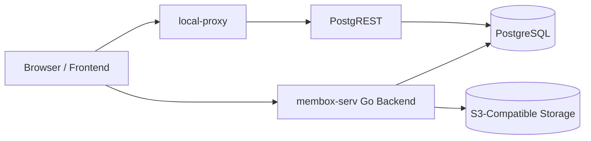

# Membox Service Project Documentation

This document describes the `membox-serv` backend in English. It is written for developers who need to understand the project structure, runtime behavior, configuration model, and deployment flow without reverse-engineering the repository first.

---

## 1. Project Overview

`membox-serv` is a Go backend service built for the AddMoments / Membox platform. It handles authentication, event management, guest media uploads, product and payment flows, promo code management, admin APIs, Nova Poshta shipping integration, S3-based file operations, and several background jobs.

The main application starts from `main.go`. It uses Gorilla Mux for routing, PostgreSQL as the primary database, and S3-compatible object storage for media/files. In production mode, the service runs HTTPS directly on `:443` and redirects HTTP traffic from `:80` to HTTPS.

The repository also contains a separate Go module under `db-shell/local-proxy`. That service is a JWT-validating reverse proxy in front of PostgREST. It allows selected database access to be served through PostgREST while keeping token validation in the proxy layer.

## 2. Technology Stack

Backend:

- Go `1.24.2`
- Gorilla Mux
- PostgreSQL with `lib/pq`
- `huandu/go-sqlbuilder`
- JWT (`golang-jwt/jwt/v5`)
- bcrypt (`golang.org/x/crypto`)
- AWS SDK for Go v1 for S3-compatible storage
- LiqPay and mock payment provider
- SMTP email delivery
- Nova Poshta API integration
- QR generation with `yeqown/go-qrcode`
- Excel export with `xuri/excelize/v2`

Operations:

- systemd services
- SSH/SCP based deployment scripts
- HTTPS via Let's Encrypt certificate files
- PostgREST plus a separate local proxy deployment

The repository currently does not include Docker, docker-compose, CI workflow, Makefile, README, or Go test files.

## 3. Root Structure

```text
ukr-membox-serv-main/
├── main.go
├── go.mod
├── go.sum
├── src/
├── shell/
├── db-shell/
├── PROJECT_DOCUMENTATION.md
└── *.md
```

Important root-level paths:

- `main.go`: Main application entry point. It wires routing, providers, workers, middleware, and HTTP/HTTPS servers.
- `go.mod` / `go.sum`: Dependency definitions for the main Go service.
- `src/`: Application source code.
- `shell/`: Deployment, systemd setup, and restart scripts for the main backend service.
- `db-shell/`: PostgreSQL setup scripts, PostgREST configuration, and the local proxy that sits in front of PostgREST.
- `*.md`: Previous analysis, recovery, and implementation notes.

## 4. `src/` Directory

The `src/` directory splits the backend into focused modules:

- `src/env/`: Loads the `.env` file. Despite its name, the file content is JSON.
- `src/auth/`: JWT creation/validation, auth middleware, super admin middleware, and order panel middleware.
- `src/db_layer/`: PostgreSQL connection, query helpers, and `LISTEN/NOTIFY` support.
- `src/db_scripts/`: Domain-level queries such as event tier, features, admin checks, user creation, and user removal.
- `src/routes/`: HTTP handlers for auth, upload, product, order, promo, admin, QR, download, and Nova Poshta proxy flows.
- `src/payments/`: Payment provider abstraction and callback flow.
- `src/liqpay/`: LiqPay provider implementation.
- `src/mock_paynet/`: Mock payment provider for local/dev simulation.
- `src/s3-wrap/`: S3 upload/download, presigned URLs, zip export, and storage size calculation.
- `src/worker/`: PostgreSQL-backed job queue. Currently used for the `s3_export` worker.
- `src/storage_cron/`: Event storage lifecycle tasks, including warning email and soft-delete behavior.
- `src/promo_cron/`: Periodic promo code expiration and usage-limit checks.
- `src/event_cleanup/`: Helpers for event media cleanup and snapshots.
- `src/send_email/`: SMTP setup and HTML email delivery.
- `src/novaposhta/`: Nova Poshta address and waybill API client.
- `src/qr/`: QR code generation.
- `src/mycrypto/`: Encryption, hashing, and random helper utilities.
- `src/network_utils/`: JSON response and error helpers.
- `src/types/`: Shared Go types.
- `src/utils/`: UUID, hex, and error helpers.
- `src/serve-react/` and `src/wp-proxy/`: Older or alternative frontend proxy attempts. The active path in `main.go` uses redirects instead.

## 5. Application Startup Flow

The main service starts in `main.go`.

The `init()` function:

1. Treats the service as live when `os.Args[1] == "true"`.
2. Writes a PID file in live mode.
3. Loads `.env` through `env.Env_init(is_live)`.
4. Initializes the S3 client.
5. Opens and verifies the PostgreSQL connection.
6. Initializes SMTP email delivery.
7. Starts storage and promo cron tasks.

The `main()` function:

1. Creates the Gorilla Mux router.
2. Initializes payment providers (`mock_paynet`, `liqpay`).
3. Creates the `s3_export` worker with two instances.
4. Listens for PostgreSQL `job_insert` notifications.
5. Registers `/auth`, `/api`, `/l`, and `/ui` routes.
6. Applies CORS middleware.
7. In live mode, starts HTTPS on `:443` and HTTP-to-HTTPS redirect on `:80`.
8. In dev mode, starts HTTP on `.env.local_port`.

Run modes:

```bash
go run main.go
```

Development mode. Runs over HTTP on the configured local port.

```bash
go run main.go true
```

Live mode. Uses HTTPS on `:443` and HTTP-to-HTTPS redirect on `:80`.

The production systemd service runs:

```bash
/home/ubuntu/membox-serv/main true
```

## 6. API Structure

Routes are centrally registered in `main.go`.

Main route groups:

- `/auth`: Email/password sign-in, whoami, account deletion, signup email token flow, password reset, collaborator operations, and event deletion.
- `/api/upload/{purpose}`: Authenticated upload.
- `/api/guest/upload/{eventPackedUid}/{utype}`: Guest upload flow using the `webanon` role.
- `/api/qr/{eventPackedUid}`: Event QR settings.
- `/api/calc-size/{eventPackedUid}`: Event storage size calculation.
- `/api/products`: Product listing.
- `/api/purchase`: Purchase creation.
- `/api/purchase/{encPackedUID}/status`: Purchase status.
- `/api/promo/validate`: Promo code validation.
- `/api/event/{eventPackedUid}/features`: Private feature information.
- `/api/event/{eventPackedUid}/public-features`: Public feature information.
- `/api/event/{eventPackedUid}/advertorial`: Advertorial configuration.
- `/api/event/{eventPackedUid}/stats`: Event statistics.
- `/api/event/{eventPackedUid}/extend-storage`: Storage extension action.
- `/api/admin/*`: Super admin and order panel APIs.
- `/api/np/settlements` and `/api/np/warehouses`: Nova Poshta proxy endpoints.
- `/api/download`: S3 download proxy.
- `/api/form/{formName}`: Form endpoint.
- `/api/payments/{tkn}`: Payment callback endpoint.
- `/l/{path}`: Short link redirect.
- `/ui/{path}`: Redirects to static UI assets on S3.

Authorization layers:

- `AuthMiddleware(handler, "auth")`: Regular authenticated user.
- `AuthMiddleware(handler, "webanon")`: Guest/web anonymous flows.
- `SuperAdminMiddleware`: `env.admin_emails` or DB-backed super admin role.
- `OrderPanelMiddleware`: Order admin or super admin access.

## 7. Data Layer

The main backend connects directly to PostgreSQL. Database settings come from the `db` object in `.env`.

`src/db_layer/core.go` is responsible for:

- Building the PostgreSQL connection string
- Opening the DB connection
- Running a simple connection verification query
- Providing `Query_one`, `Query_all`, and `Exec` helpers
- Supporting PostgreSQL `LISTEN/NOTIFY`

SQL queries are commonly built through `huandu/go-sqlbuilder` instead of ad hoc string concatenation.

Primary DB objects are defined in `db-shell/misc/create-tables.sql`:

- `users`
- `panel_admins`
- `credentials`
- `events`
- `events_public`
- `products`
- `carts`
- `cart_items`
- `promo_codes`
- `purchases`
- `participants`
- `uploads`
- `event_upload_snapshots`
- `global_attributes`
- `jobs`

PostgREST roles and permissions are managed in `db-shell/misc/setup.sql`:

- `webanon`: Anonymous role.
- `auth`: Authenticated JWT role.
- `webanon` is allowed to switch to `auth`.
- Permissions are granted for selected objects such as `events_public`, `products`, `uploads`, and `participants`.
- RLS and permission rules are used to constrain PostgREST access.

## 8. Background Jobs

The project includes several background processes.

`storage_cron`:

- Tracks event storage lifecycle.
- Sends warning emails before expiration.
- Runs soft-delete behavior when storage expires.

`promo_cron`:

- Periodically checks promo code `valid_until`, usage limit, and active status.
- Deactivates expired or fully used codes.

`worker`:

- Implements a queue over the `jobs` table.
- Uses `FOR UPDATE SKIP LOCKED` to prevent duplicate job processing.
- Listens for the `job_insert` PostgreSQL notification.
- Currently runs `routes.Export_s3` for `s3_export` jobs.

## 9. Configuration

The main service reads a `.env` file from its working directory. The file is gitignored and must not contain committed secrets.

**Important: In this project, `.env` is JSON, not classic `KEY=value` syntax.**

Expected shape:

```json
{
  "serv_root": "serv.addmoments.com.ua",
  "local_port": 8080,
  "db": {
    "host": "localhost",
    "port": 5432,
    "username": "user",
    "password": "password",
    "dbname": "membox_db"
  },
  "dev_key": "...",
  "jwt_secret": "...",
  "s3": {
    "key_id": "...",
    "key_secret": "...",
    "bucket": "...",
    "region": "...",
    "endpoint": "..."
  },
  "payment_secret": "...",
  "smtp": {
    "outgoing_server": "...",
    "smtp_port": 587,
    "username": "...",
    "password": "...",
    "display_name": "..."
  },
  "server_unique_name": "membox-prod-1",
  "admin_emails": ["admin@example.com"],
  "liqpay": {
    "public_key": "...",
    "private_key": "...",
    "sandbox": false
  },
  "nova_poshta": {
    "api_key": "...",
    "sender_ref": "...",
    "sender_contact_ref": "...",
    "sender_address_ref": "...",
    "sender_city_ref": "...",
    "sender_phone": "..."
  }
}
```

`db-shell/local-proxy` uses a separate config file:

```json
{
  "listenHttps": true,
  "listenHttp": false,
  "localPort": 3000,
  "certPath": "/path/to/fullchain.pem",
  "keyPath": "/path/to/privkey.pem",
  "jwtSecret": "..."
}
```

PostgREST has an example configuration in `db-shell/misc/-etc-postgrest.conf.example`.

Sensitive files excluded by gitignore:

- `.env`
- `*.pem`
- `local-proxy-config.json`
- `*postgrest.conf`
- `mockpnet/`

## 10. Deployment

### 10.1 Main Backend Service

Main deploy script:

```bash
shell/deploy.sh
```

What the script does:

1. Creates a tar package with `src/`, `shell/`, `main.go`, `go.mod`, `go.sum`, and `.env`.
2. Excludes the PEM file from the archive.
3. Copies the archive to `ubuntu@16.171.47.166:/home/ubuntu/membox-serv/` via SCP.
4. Extracts the archive on the remote server.
5. Runs `go build main.go`.
6. Removes the remote `src/` source directory after build.
7. Runs `systemctl daemon-reload`.
8. Restarts the `membox-serv` systemd service.
9. Prints the service status.

Systemd unit:

```text
shell/servicefile.service
```

Service details:

- Service name: `membox-serv`
- Working directory: `/home/ubuntu/membox-serv`
- ExecStart: `/home/ubuntu/membox-serv/main true`
- User/Group: `root`
- Restart policy: `always`

Initial setup:

```bash
shell/setup.sh
```

This script is intended to be pasted line by line into an SSH session. It copies the service file to `/etc/systemd/system/membox-serv.service`, reloads systemd, restarts the service, and enables it.

Restart and logs:

```bash
shell/restart_serv.sh
```

It runs:

- `sudo systemctl restart membox-serv`
- `sudo systemctl status membox-serv`
- `journalctl -u membox-serv -n 100 -f`

### 10.2 DB Proxy / PostgREST Deployment

`db-shell/local-proxy` is a separate Go module. It works as a JWT-validating reverse proxy in front of PostgREST instead of exposing PostgREST directly.

Deploy script:

```bash
db-shell/deploy-local-proxy.sh
```

What the script does:

1. Packages `db-shell/local-proxy/`.
2. Copies it to `ubuntu@13.53.198.197:/home/ubuntu/db-proxy/`.
3. Extracts the archive remotely.
4. Runs `go build local-proxy.go`.
5. Removes source files after build.

Remote restart script:

```bash
db-shell/deploy-remote.sh
```

Example systemd service files:

- `db-shell/misc/-etc-systemd-system-localproxy.service`
- `db-shell/misc/-etc-systemd-system-postgrest.service`

PostgREST example config:

```text
db-shell/misc/-etc-postgrest.conf.example
```

High-level architecture:



## 11. Local Development

Minimum setup:

1. Install Go `1.24.2` or a compatible version.
2. Prepare PostgreSQL access.
3. Prepare S3-compatible storage credentials.
4. Prepare dev/test credentials for SMTP, LiqPay, and Nova Poshta.
5. Add a JSON-formatted `.env` file at the repository root.
6. Download dependencies:

```bash
go mod download
```

7. Run the service in development mode:

```bash
go run main.go
```

In dev mode:

- HTTPS is not used.
- The port comes from `.env.local_port`.
- Unknown frontend routes redirect to `http://localhost:3000`.
- `/api/purchase/{encPackedUID}/simulate-success` is only available in dev mode.

## 12. Build, Test, and Checks

Build the main service:

```bash
go build main.go
```

Validate all Go packages by build:

```bash
go build ./...
```

Run the main service locally:

```bash
go run main.go
```

Simulate live mode:

```bash
go run main.go true
```

Build the DB proxy:

```bash
cd db-shell/local-proxy
go build local-proxy.go
```

Test:

```bash
go test ./...
```

Note: The repository currently has no `*_test.go` files, so no explicit test coverage is defined.

Format:

```bash
go fmt ./...
```

Lint:

There is currently no official `golangci-lint` or CI lint configuration in the repository.

## 13. Security and Operations Notes

- `.env`, PEM files, and proxy config files must not be committed.
- `shell/deploy.sh` copies `.env` to the production server, so the local file must match the target environment before deployment.
- In production mode, the main service reads Let's Encrypt certificates from fixed paths:
  - `/etc/letsencrypt/live/serv.addmoments.com.ua/fullchain.pem`
  - `/etc/letsencrypt/live/serv.addmoments.com.ua/privkey.pem`
- CORS is currently wildcard-based. For public production usage, an explicit origin allowlist should be considered.
- Super admin access is related to both `env.admin_emails` and the database-backed `panel_admins` model.
- PostgreSQL uses `sslmode=disable` in the current connection string. TLS requirements should be reviewed based on network topology and database placement.
- Deployment scripts contain direct IP and username values. Over time, these should be moved to environment variables or CI/CD secrets.

## 14. Developer Quick Map

To add a new endpoint:

1. Create or update a handler under `src/routes/`.
2. Put reusable domain queries in `src/db_scripts/` or the relevant route module.
3. Select the right middleware for the authorization requirement.
4. Register the route under the correct prefix in `main.go`.
5. If the database schema changes, update `db-shell/misc/create-tables.sql` and, if needed, `setup.sql`.
6. Validate with `go build ./...`.

To add a new config field:

1. Add a field with a JSON tag to the `env` struct in `src/env/env-init.go`.
2. Add the corresponding value to local and production `.env` files.
3. If the value is secret, never commit the real value.

To add a new background job:

1. Review the current `jobs` table behavior.
2. Reuse the `Worker` structure from `src/worker/`.
3. Implement a job handler matching the `Worker_job_func` signature.
4. Initialize the worker in `main.go` and wire it to DB notifications if needed.
